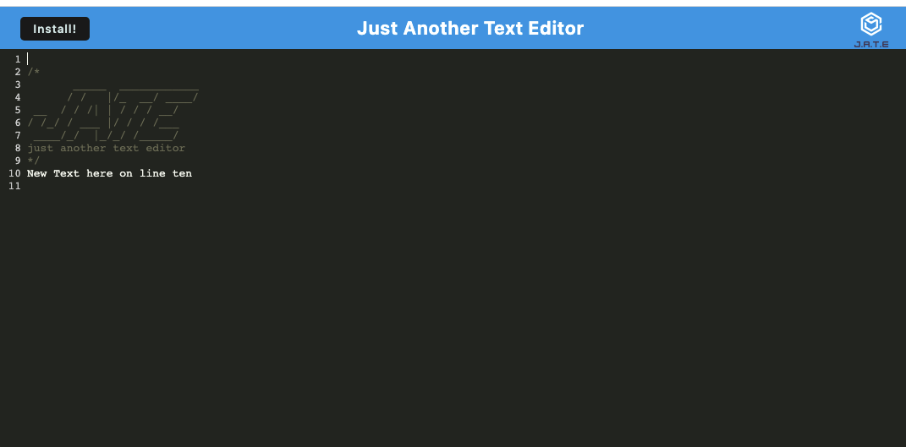

# Challenge Nineteen: KN Text Editor

## Description

### For this challenge, I created a text editor that runs in the browser and also meets PWA criteria to function offline. Users can add text or delete that will save to the application. Users can create notes or code snippets with or without an internet connection.

## Table of Contents

### [Installation](#installation)

### [Usage](#usage)

### [Credits](#credits)

### [License](#license)

## Installation

### To use this application, access it using the Heroku deployed link here: [https://hidden-gorge-32319.herokuapp.com/](https://hidden-gorge-32319.herokuapp.com/).

## Usage

### This application is to be used to create, edit, and save text while online or offline. The text can be reliably retrieved for later use.

### This image shows the application:

### 

## Credits

### Starter code was provided to me for this application. The starter code can be found here: [starter code](https://github.com/coding-boot-camp/cautious-meme) I used what I learned in the BootCamp Spot modules and BootCamp classes to create this application. I especially used what I learned in Module 19 and the code that was given through Module 19 as a guide for this challenge. I also used the activities from virtual classes to assist me with this challenge. I used [mdn web docs](https://developer.mozilla.org/en-US/docs/Web/API/IndexedDB_API/Using_IndexedDB) to better understand using IndexedDB, especially with the PUT method. I used this site: [codelab](https://web.dev/codelab-make-installable/) to find code for the butInstall event listener for the installation button. I used this site to better understand adding functionality to the install button: https://pwa-workshop.js.org/5-pwa-install/#add-an-installation-button. I also used the workbox documentation to better understand caching: [workbox](https://developer.chrome.com/docs/workbox/).

## License

### The MIT License

#### Copyright 2022 Kristy Nerhaugen

#### Permission is hereby granted, free of charge, to any person obtaining a copy of this software and associated documentation files (the "Software"), to deal in the Software without restriction, including without limitation the rights to use, copy, modify, merge, publish, distribute, sublicense, and/or sell copies of the Software, and to permit persons to whom the Software is furnished to do so, subject to the following conditions:

#### The above copyright notice and this permission notice shall be included in all copies or substantial portions of the Software.

#### THE SOFTWARE IS PROVIDED "AS IS", WITHOUT WARRANTY OF ANY KIND, EXPRESS OR IMPLIED, INCLUDING BUT NOT LIMITED TO THE WARRANTIES OF MERCHANTABILITY, FITNESS FOR A PARTICULAR PURPOSE AND NONINFRINGEMENT. IN NO EVENT SHALL THE AUTHORS OR COPYRIGHT HOLDERS BE LIABLE FOR ANY CLAIM, DAMAGES OR OTHER LIABILITY, WHETHER IN AN ACTION OF CONTRACT, TORT OR OTHERWISE, ARISING FROM, OUT OF OR IN CONNECTION WITH THE SOFTWARE OR THE USE OR OTHER DEALINGS IN THE SOFTWARE.
